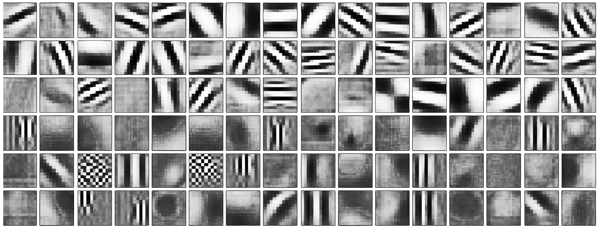

# Session 2

* * *

>Welcome Everyone!  
>

**Administrative Stuff**

1.  Assignments are shared already. Sorry for
2.  Google Drive link is also shared, you need to upload files to your respective batches.
3.  Deadline is tomorrow 11:30PM.
4.  Remember, only .md files would be recognized.

# Let's get started

## Normalization

## This is how filters look after training.

**Value Chart**  

Do you see something wrong?

What is the difference in these two?

#### Without Normalization

#### With Normalization

  
Money distribution is normalized.

# Back Propagation

Bacprop is something which can make you feel punching someone.

But there is hope!

## Let's build things step by step.

After **Session 1** we have some idea on how Neural Networks are built.

### A NEURON/PERCEPTRON

A special block which can take multiple inputs and produces one output:

## Let's build a few neurons

Let us assume that we got these inputs:

<table data-line="188">

<thead>

<tr>

<th>Variable Name</th>

<th>Value</th>

</tr>

</thead>

<tbody>

<tr>

<td>X1</td>

<td>0</td>

</tr>

<tr>

<td>X2</td>

<td>1</td>

</tr>

<tr>

<td>X3</td>

<td>1</td>

</tr>

</tbody>

</table>

### NEURON DYNAMICS OR HOW TO MAKE TEA?

**SIMPLY JUST COMBINE** (Combine 1 glass milk, 1 glass water, 1 glass sugar and 1 glass tea!)  
Let us assume our neuron was programmed to output 1 if the sum below is more than 2:

<math><semantics><mrow><mi>s</mi><mi>u</mi><mi>m</mi></mrow><annotation encoding="application/x-tex">sum</annotation></semantics></math>sum = <math><semantics><mrow><msub><mi>X</mi><mn>1</mn></msub></mrow><annotation encoding="application/x-tex">X_1</annotation></semantics></math>X1​ + <math><semantics><mrow><msub><mi>X</mi><mn>2</mn></msub></mrow><annotation encoding="application/x-tex">X_2</annotation></semantics></math>X2​ + <math><semantics><mrow><msub><mi>X</mi><mn>3</mn></msub></mrow><annotation encoding="application/x-tex">X_3</annotation></semantics></math>X3​

**DON'T SIMPLY JUST COMBINE, MIX WITH CARE** (Build and then follow the recepie… I glass water, 1 Spoon Sugar…)

Instead of just adding these raw inputs, we assign them weights. Weights give importance to an input. To compute the putput, we will multiply input with respective weights  
<math><semantics><mrow><msub><mi>W</mi><mn>1</mn></msub></mrow><annotation encoding="application/x-tex">W_1</annotation></semantics></math>W1​ = 0.5,  
<math><semantics><mrow><msub><mi>W</mi><mn>2</mn></msub></mrow><annotation encoding="application/x-tex">W_2</annotation></semantics></math>W2​ = 1.5,  
<math><semantics><mrow><msub><mi>W</mi><mn>3</mn></msub></mrow><annotation encoding="application/x-tex">W_3</annotation></semantics></math>W3​ = 0.7,

<table data-line="218">

<thead>

<tr>

<th>Variable Name</th>

<th>Value</th>

<th>Weight</th>

</tr>

</thead>

<tbody>

<tr>

<td>X1</td>

<td>0</td>

<td>0.5</td>

</tr>

<tr>

<td>X2</td>

<td>1</td>

<td>1.5</td>

</tr>

<tr>

<td>X3</td>

<td>1</td>

<td>0.7</td>

</tr>

</tbody>

</table>

and compare with our threshold value:

<math><semantics><mrow><mi>s</mi><mi>u</mi><mi>m</mi></mrow><annotation encoding="application/x-tex">sum</annotation></semantics></math>sum = <math><semantics><mrow><msub><mi>X</mi><mn>1</mn></msub></mrow><annotation encoding="application/x-tex">X_1</annotation></semantics></math>X1​.<math><semantics><mrow><msub><mi>W</mi><mn>1</mn></msub></mrow><annotation encoding="application/x-tex">W_1</annotation></semantics></math>W1​ + <math><semantics><mrow><msub><mi>X</mi><mn>2</mn></msub></mrow><annotation encoding="application/x-tex">X_2</annotation></semantics></math>X2​.<math><semantics><mrow><msub><mi>W</mi><mn>2</mn></msub></mrow><annotation encoding="application/x-tex">W_2</annotation></semantics></math>W2​ + <math><semantics><mrow><msub><mi>X</mi><mn>3</mn></msub></mrow><annotation encoding="application/x-tex">X_3</annotation></semantics></math>X3​.<math><semantics><mrow><msub><mi>W</mi><mn>3</mn></msub></mrow><annotation encoding="application/x-tex">W_3</annotation></semantics></math>W3​  
<math><semantics><mrow><mi>s</mi><mi>u</mi><mi>m</mi></mrow><annotation encoding="application/x-tex">sum</annotation></semantics></math>sum = <math><semantics><mrow><mn>0</mn><mo>∗</mo><mn>0</mn><mi mathvariant="normal">.</mi><mn>5</mn><mo>+</mo><mn>1</mn><mo>∗</mo><mn>1</mn><mi mathvariant="normal">.</mi><mn>5</mn><mo>+</mo><mn>1</mn><mo>∗</mo><mn>0</mn><mi mathvariant="normal">.</mi><mn>7</mn></mrow><annotation encoding="application/x-tex">0 * 0.5 + 1 * 1.5 + 1 * 0.7</annotation></semantics></math>0∗0.5+1∗1.5+1∗0.7 = <math><semantics><mrow><mn>0</mn><mo>+</mo><mn>1</mn><mi mathvariant="normal">.</mi><mn>5</mn><mo>+</mo><mn>0</mn><mi mathvariant="normal">.</mi><mn>7</mn></mrow><annotation encoding="application/x-tex">0 + 1.5 + 0.7</annotation></semantics></math>0+1.5+0.7 = <math><semantics><mrow><mn>2</mn><mi mathvariant="normal">.</mi><mn>2</mn></mrow><annotation encoding="application/x-tex">2.2</annotation></semantics></math>2.2

**ADD SOME BIAS**

Add some love to your Tea!

Each neuron also has a bias which can be thought of as how much flexible it is. It allows **the line to move up or down** to fir the prediction.

<math><semantics><mrow><mi>s</mi><mi>u</mi><mi>m</mi></mrow><annotation encoding="application/x-tex">sum</annotation></semantics></math>sum = <math><semantics><mrow><msub><mi>X</mi><mn>1</mn></msub></mrow><annotation encoding="application/x-tex">X_1</annotation></semantics></math>X1​.<math><semantics><mrow><msub><mi>W</mi><mn>1</mn></msub></mrow><annotation encoding="application/x-tex">W_1</annotation></semantics></math>W1​ + <math><semantics><mrow><msub><mi>X</mi><mn>2</mn></msub></mrow><annotation encoding="application/x-tex">X_2</annotation></semantics></math>X2​.<math><semantics><mrow><msub><mi>W</mi><mn>2</mn></msub></mrow><annotation encoding="application/x-tex">W_2</annotation></semantics></math>W2​ + <math><semantics><mrow><msub><mi>X</mi><mn>3</mn></msub></mrow><annotation encoding="application/x-tex">X_3</annotation></semantics></math>X3​.<math><semantics><mrow><msub><mi>W</mi><mn>3</mn></msub></mrow><annotation encoding="application/x-tex">W_3</annotation></semantics></math>W3​ + <math><semantics><mrow><mn>1</mn></mrow><annotation encoding="application/x-tex">1</annotation></semantics></math>1.<math><semantics><mrow><mi>b</mi></mrow><annotation encoding="application/x-tex">b</annotation></semantics></math>b

#### ACTIVATION FUNCTION

IT takes the sum of weighted inputs as an argument and return the output of the neuron

### FORWARD PROPAGATION, BACK PROPAGATION AND EPOCHS

Till now, we have computed the output and this process is known as **Forward Propagation**. But what if the estimated output is far away from the actual output (high error). In the neural network what we do, we update the biases and weights based on the error. This weight and bias updating process is known as **Back Propagation**.

**Back-propagation** (BP) algorithms work by determining the loss (or error) at the output and then propagating it back into the network. The weights are updated to minimize the error resulting from each neuron. The first step in minimizing the error is to determine the gradient (Derivatives) of each node w.r.t. the final output.

This one round of forward and back propagation iteration is known as one training iteration aka **Epoch**.

## MULTILAYER PERCEPTRON

the single-layer network can do only so much. An MLP consists of multiple layers called Hidden Layers stacked in between the Input Layer and the Output Layer as shown below:  

## LETS MOVE ON TO THE THEORY NOW

## But don't worry

## Broad Steps

**Step 0**: Read input and output  

**Step 1**: Initialize weights and biases with random values (There are methods to initialize weights and biases but for now initialize with random values)

**Step 2**: Calculate hidden layer input:

`eip_input = matrix_dot_product(eip,mlbr_input) + bh`

**Step 3**: Perform non-linear transformation on hidden linear input

`eip_list = sigmoid(eip_input)`

**Step 4**: Perform linear and non-linear transformation of hidden layer activation at output layer

`eip_dictionary = matrix_dot_product (eip_list * wout ) + bout 
mlbr_output = sigmoid(mlbr_output_layer_input)`

**Step 5**: Calculate gradient of Error(E) at output layer

`E = y-mlbr_output`

**Step 6**: Compute slope at output and hidden layer

`eip_out= derivatives_sigmoid(output)

Slope_hidden_layer = derivatives_sigmoid(eip_list)`

**Step 7**: Compute delta at output layer

`d_output = E * slope_output_layer*lr`

**Step 8**: Calculate Error at hidden layer

`Error_at_hidden_layer = matrix_dot_product(d_output, wout.Transpose)`

**Step 9**: Compute delta at hidden layer

`d_hiddenlayer = Error_at_hidden_layer * slope_hidden_layer`

**Step 10**: Update weight at both output and hidden layer

`wout = wout + matrix_dot_product (eiplist.Transpose, d_output) * learning_rate`

`mlbr_input = mlbr_input+ matrix_dot_product (eip.Transpose,d_hiddenlayer) * learning_rate`

**Step 11**: Update biases at both output and hidden layer

`bh = bh + sum(d_hiddenlayer, axis=0) * learning_rate`

`bout = bout + sum(d_output, axis=0)*learning_rate`

[REFERENCE](https://www.analyticsvidhya.com/blog/2017/05/neural-network-from-scratch-in-python-and-r/)

Hopefully this is how you are feeling :

And that's how it's done!  

* * *

# PYTHON FOUNDATION

[Python 101](https://github.com/machinelearningblr/machinelearningblr.github.io/blob/master/tutorials/CS231n-Materials/CS231n-python-numpy-tutorial.ipynb)

[bit.ly/2F3fbkk](http://bit.ly/2F3fbkk)

# Assignment 2A

Rewrite the whole notebook with these rules:

*   you can only use these variables: eip, mlblr, eip_in, eip_out, mlblr_in, mlblr_out, eip_list, eip_dict.
*   once, you're done, you need to upload it to your Public Github account, learn how to commit a project to github, and then share the link to your assignment.
*   deadline is t + 7 days.

# Assignment 2B

*   Write a python file to create the random needed to write the backprop table.
*   Rewrite the Backpropagation table with new random values using MarkDown.
*   Download Boostnote (or any markdown editor you prefer) and email back your file in this format **FIRSTNAME_BATCH_X_ASSIGNMENT2B.md**
*   You can refer this link to learn about markdown: [Markdown Cheatsheet](https://github.com/adam-p/markdown-here/wiki/Markdown-Cheatsheet)